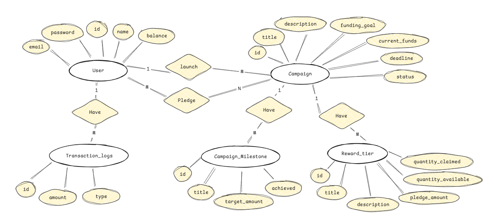
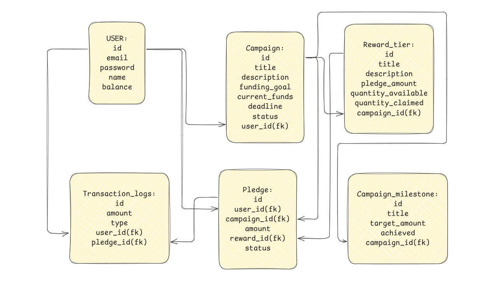

# Crowdfunding Platform

## Overview
This project is a crowdfunding platform built with TypeScript, Sequelize, and Zod, designed to support high-concurrency, transaction-heavy operations. It enables users to create campaigns, pledge funds, and receive rewards, with a focus on data consistency, auditability, and performance. The backend uses PostgreSQL for data storage, with a robust transaction system to handle financial operations and concurrency challenges.

## System Architecture
The platform follows a modular architecture:
- **Backend**: Node.js with TypeScript, using Sequelize for ORM and Zod for schema validation.
- **Database**: PostgreSQL, with tables for users, campaigns, pledges, reward tiers, campaign milestones, and transaction logs. See the Entity-Relationship Diagram at `images/er_diagram.png` and the database schema mapping at `images/table_mapping.png`.
- **Repositories**: Separate modules for each entity (e.g., `campaignRepository`, `pledgeRepository`) to encapsulate database operations.
- **Cron Jobs**: Automated tasks for handling campaign closures and refunds.
- **Validation**: Zod schemas ensure data integrity for entities like campaigns, pledges, and reward tiers.

## Features
- **User Management**:
  - Users register and maintain a wallet balance for pledging.
  - Balance updates occur during deposits, pledges, and refunds.
- **Campaign Creation**:
  - Users create campaigns with a title, description, funding goal, and deadline.
  - Campaigns have an auto-incremented ID and a status (`active`, `successful`, `failed`).
- **Pledging**:
  - Backers pledge funds to active campaigns, optionally selecting reward tiers.
  - Pledges have statuses: `pending` (awaiting payment), `confirmed` (payment complete), or `refunded` (returned).
- **Reward Tiers**:
  - Campaigns offer reward tiers with limited quantities (e.g., 50 water bottles for $15).
  - Tracks `quantity_available` and `quantity_claimed` to manage availability.
- **Campaign Milestones**:
  - Stretch goals that unlock when campaign funds exceed target amounts (e.g., $7,500 for BPA-free coating).
  - Tracks `achieved` status based on `current_funds`.
- **Refunds**:
  - Automatic refunds for failed campaigns (funding goal not met by deadline).
  - Supports individual pledge cancellations (if enabled).
- **Transaction Logs**:
  - Records all financial events (`pledge`, `refund`, `deposit`) for auditability.
  - Includes `user_id`, `pledge_id` (if applicable), `amount`, and `type`.
- **Cron Jobs**:
  - Scheduled tasks to close campaigns and process refunds for failed campaigns.

## Transaction Handling
Transactions ensure data consistency across multiple tables, using Sequelize’s transaction API with SERIALIZABLE and REPEATABLE_READ isolation level to prevent anomalies. Key transactions include:

1. **Campaign Creation**:
   - Inserts a campaign and optional milestones/rewards atomically.
   - Steps: Validate input with Zod, lock user row, insert campaign, insert milestones/rewards, log event (`campaign_created`), commit or rollback.

2. **Pledge Processing**:
   - Handles pledge creation, updating user balance, campaign funds, and reward tiers.
   - Steps: Validate input, lock user/campaign/reward tier, check availability/status, update balance/funds/reward quantities, insert pledge (`pending` or `confirmed`), update milestones, log event (`pledge` or `pledge_confirmed`), commit or rollback.

3. **Refund Processing**:
   - Refunds pledges for failed campaigns or canceled pledges.
   - Steps: Lock campaign/pledges/users/reward tiers, update balance/funds/reward quantities, set pledge `status = 'refunded'`, reset milestones, log event (`refund`), commit or rollback.

4. **Campaign Closure**:
   - Updates campaign status (`successful` or `failed`) at deadline.
   - Steps: Lock campaign, check funds vs. goal, update status, transfer funds (if successful) or trigger refunds (if failed), log event (`campaign_closed`), commit or rollback.

## Concurrency Management
The platform handles high concurrency using:
- **Pessimistic Locking**: `FOR UPDATE` locks on rows (e.g., user balance, campaign funds, reward quantities) prevent race conditions during pledges and refunds.
- **SERIALIZABLE Isolation**: Ensures no phantom reads or write skews, critical for pledge rushes.
- **Bulk Operations**: Used in cron jobs to reduce database round-trips (e.g., bulk refund pledges).

## Setup and Installation
1. **Prerequisites**:
   - Node.js (v18+)
   - PostgreSQL (v13+)
   - npm or yarn
2. **Install Dependencies**:
   ```bash
   npm install
   ```


## API Endpoints (Examples)
- **POST /campaigns**: Create a campaign.
- **POST /pledges**: Create a pledge (pending or confirmed).
- **GET /campaigns/:id**: View campaign details, milestones, and rewards.
- **POST /users/deposit**: Add funds to user balance.

## Development Notes
- **Validation**: Zod schemas (`CampaignSchema`, `PledgeSchema`, etc.) enforce data integrity.
- **Error Handling**: All transactions include try-catch blocks with automatic rollback.
- **Testing**: Use seed data for testing. Ensure user with `id = 1` exists before seeding campaigns.
- **Scalability**: Consider Redis for caching campaign data and BullMQ for queuing large refund jobs.

## Database Diagrams
- **ER Diagram**: Located at `images/er_diagram.png`.
  
- **Table Mapping**: Located at `images/table_mapping.png`.
  
